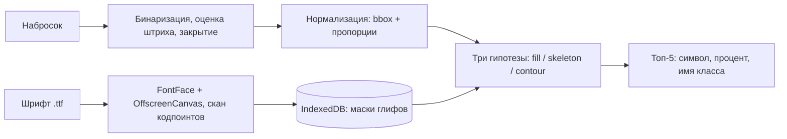

# Saby Icon Search — расширение Chrome

Нарисуйте иконку в popup — расширение найдёт похожие иконки в вашем шрифте и отдаст имя класса
из `.less` (например, `icon-ClientChat`), готовое к вставке в разметку.

Полностью на фронтенде: ни бэкенда, ни обучения.

---

## Как это работает



- **Три гипотезы**, побеждает лучшая: `fill` (границы силуэтов + IoU), `skeleton` (медиальные оси
  штрихов) и `contour` (линии наброска против контура глифа). Расстояние — симметричный Чампфер
  с экспоненциальным усреднением, чтобы далёкие точки весили больше.
- **Два кадра нормализации**: `fitted` (пропорции сохранены) и `stretched` (bbox растянут).
  Второй считается, только когда первый не дал уверенного совпадения.
- **Поиск двухступенчатый**: грубый отбор оставляет 800 кандидатов, затем точное сравнение
  в 64×64 с пятью поворотами (−10°…+10°).
- **Проценты относительные**: 100% — «лучше всех в этом пуле», а не абсолютная вероятность.
  Сырые метрики — под галкой «Показывать отладочные данные».
- **Индексация**: `FontFace` декодирует шрифт сам (ttf/woff/woff2 — силами Chrome), кодпоинты проверяются
  через `document.fonts.check`, каждый глиф нормализуется к 64×64 и кладётся в IndexedDB
  бинарной маской (4 КБ на глиф).

## Архитектура

| Контекст            | Роль                                                       |
| ------------------- | ---------------------------------------------------------- |
| `popup.html`        | Только UI. Может закрываться в любой момент.               |
| `service-worker.js` | Создаёт offscreen-документ и следит, чтобы он существовал. |
| `offscreen.html`    | Движок: растеризация, индексация, сопоставление.           |

Popup уничтожается при потере фокуса, поэтому индексация идёт в offscreen-документе — обычной
DOM-странице, где доступны `FontFace`, `OffscreenCanvas` и IndexedDB. Сообщения ходят через
`chrome.runtime.sendMessage` (JSON), бинарные данные — в base64; сами шрифты передаются не
сообщением, а через общий IndexedDB по `fontId`. Набросок восстанавливается при следующем
открытии popup.

## Сборка и установка

```bash
npm install
npm run build      # typecheck + vite build → dist/ + архив релиза
```

Дальше: `chrome://extensions` → включить **Режим разработчика** → **Загрузить распакованное
расширение** → выбрать папку `dist/saby-icon-search-extension`.

| Что в `dist/`                    | Зачем                                                       |
| -------------------------------- | ----------------------------------------------------------- |
| `saby-icon-search-extension/`    | расширение для загрузки распакованным                       |
| `saby-icon-search-extension.zip` | архив для релиза на GitHub (внутри — содержимое без папки)  |

Для разработки удобно `npm run watch` — Vite пересобирает, в `chrome://extensions` жмём «Обновить».

### Отладочный стенд

```bash
npm run dev
```

Открывается `http://localhost:5173/` — тот же `App` во фрейме 400×580, но движок работает прямо
в странице (без offscreen-документа и service worker), есть HMR. Корневой `index.html` в сборку
не попадает.

### Команды

| Команда             | Что делает                                            |
| ------------------- | ----------------------------------------------------- |
| `npm run build`     | Проверка типов + сборка в `dist/` и архив релиза       |
| `npm run watch`     | Пересборка при изменениях (архив тоже пересобирается) |
| `npm run typecheck` | Только проверка типов                                 |
| `npm test`          | Тесты ядра и упаковщика архива (Vitest, без браузера) |

## Встроенные файлы

В поставку вшиты шрифт и стили, поэтому расширение работает сразу после установки:

| Файл                               | Что это                               |
| ---------------------------------- | ------------------------------------- |
| `public/defaults/cbuc-icons.ttf`   | шрифт иконок                          |
| `public/defaults/_glyphs.less`     | стили с именами классов и кодпоинтами |

- Ставятся автоматически при первом запуске; удалить их нельзя (бейдж «встроенный»), только
  обновить — перечитать файл из поставки.
- Свои шрифты и стили **дополняют** вшитые. При конфликте кодпоинтов выигрывает добавленный
  позже, то есть свой. Повторно добавленный файл заменяет свою версию, а не дублируется.
- `.less` и шрифт должны быть из одной версии набора: во вшитых 315 имён объявлены, но глифа
  в шрифте нет — они не найдутся никогда. В настройках это видно предупреждением со списком.
- Диагностика — `chrome://extensions` → **Проверить представления** → `offscreen.html` → консоль.

## Настройки

Вход — шестерёнка внизу справа. Источники: **стили (.less)** и **шрифт (.woff/.woff2/.ttf/.eot)** —
файлом или по ссылке. Прогресс показывает этапы: загрузка → разбор глифов → сохранение.

- Доступ к сайтам проверяется сразу при открытии popup: запрос разрешения уводит фокус и
  закрывает popup, поэтому незавершённое добавление сохраняется и продолжается при следующем
  открытии.
- Группа «Для разработчиков» — галка «Показывать отладочные данные» (сырые метрики и время поиска).
- Тема и язык — в футере панели, настройки запоминаются.

## Результаты и редактор

- Показываются **топ-5**: настоящий символ шрифта, процент совпадения и имя класса из `.less`.
- Клик по ячейке — панель деталей с копированием имени класса; под отладкой видны все метрики.
- Инструменты: кисть и заливка, ползунок толщины. Заливка закрашивает только область под щелчком.
- История — 24 шага (штрих, заливка, стирание), «Очистить» тоже можно отменить.
- В футере — счётчик «Иконок: N» (сколько глифов из `.less` нашлось в шрифте) и вход в настройки.

## Иконка расширения

| Файл                           | Что это                     |
| ------------------------------ | --------------------------- |
| `public/icons/icon-16.png`     | 16 px — тулбар              |
| `public/icons/icon-32.png`     | 32 px — тулбар на HiDPI     |
| `public/icons/icon-48.png`     | 48 px — страница расширений |
| `public/icons/icon-128.png`    | 128 px — карточка в сторе   |
| `public/icons/icon-dark-*.png` | те же размеры для тёмной темы |

Chrome не выбирает иконку тулбара по теме, поэтому тёмный набор ставится в рантайме через
`chrome.action.setIcon`: тему читает offscreen-документ и сообщает service worker'у.

Исходники — в `design/icons/`: `v22.svg` (светлый), `v23.svg` (тёмный), `v22-16.svg` и
`v23-16.svg` (вариант для 16 px — поля ужаты, «93%» крупнее), `ref.png` (образец),
`preview.html` (превью).

## Структура проекта

```text
src/
├─ shared/          константы, типы, протокол, транспорт, хранилище
├─ core/
│  ├─ image/        бинаризация, морфология, distance transform, скелет, нормализация
│  ├─ features/     HOG
│  ├─ matching/     представления фигуры, гипотезы, двухступенчатый поиск
│  ├─ fonts/        FontFace, скан глифов, растеризация
│  ├─ less/         разбор .less в карту «кодпоинт → класс»
│  └─ store/        IndexedDB
├─ offscreen/       движок и диспетчер запросов
├─ background/      service worker
├─ dev/             отладочный стенд (локальный транспорт)
└─ popup/           React + HeroUI UI
```

## Ограничения

- **Без `.less` поиск шумит** — ищутся все глифы шрифта, в топ лезут математические знаки и рамки.
- **Проценты относительные** — нормируются на лучшего кандидата в пуле.
- **Поворот — только ±10°**: сильно наклонённый набросок найдёт меньше совпадений.
- **Внутренние пропорции фигуры** — главное ограничение метрики: «человечек с большой головой»
  и «с маленькой» для неё разные фигуры.
- **Потолок индекса** — комфортно до ~5000 глифов; дальше нужна ANN-структура.
- **Память** — разобранные глифы кешируются (~80 КБ на глиф; 5000 ≈ 400 МБ).
- **Веса гипотез подобраны вручную** — правильный путь — eval-набор и подбор по recall.
- **Бандл** — `@heroui/react` тянет все компоненты (~830 КБ); можно перейти на поштучные пакеты.
