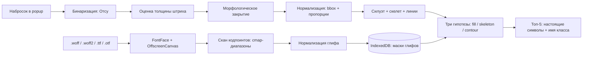

# Saby Icon Search — расширение Chrome

Нарисуйте иконку в popup — расширение найдёт самые похожие иконки в вашем шрифте
и отдаст имя класса из `.less` (например, `icon-ClientChat`), готовое к вставке в разметку.

Полностью на фронтенде: ни бэкенда, ни обучения.

---

## Как это работает



### Три гипотезы вместо одной

Набросок и глиф могут быть нарисованы принципиально по-разному, и «правильный» способ сравнения
заранее неизвестен. Человек, который рисует человечка палочками, имеет в виду залитую иконку —
силуэты у них не совпадут вообще. Поэтому для каждой пары считаются три гипотезы, и побеждает
лучшая:

| Гипотеза   | Что сравнивается                     | Что ловит                                     |
| ---------- | ------------------------------------ | --------------------------------------------- |
| `fill`     | границы залитых силуэтов + IoU       | обычный случай: набросок и глиф одной природы |
| `skeleton` | медиальные оси (скелеты) **штрихов** | «палочный» набросок против залитого глифа     |
| `contour`  | линии наброска против контура глифа  | набросок обводкой против контурной иконки     |

Заливка дыр (`fillHoles`) применяется только в `fill`, поэтому вопрос «контур или заливка»
на уровне силуэта снимается. Расстояние — симметричный Чампфер: он не чувствителен к толщине
штриха и к дрожанию руки. Внутри `fill` добавляются IoU и косинус HOG, чтобы «заполненность» и
направление границ тоже влияли на порядок.

Скелет считается по **штрихам**, а не по залитому силуэту, и это принципиально. Заливка — это
интерпретация, и у наброска с глифом она расходится: у глифа голова-кольцо и ноги замыкаются
в треугольник, заливка превращает ноги в монолит, а у наброска те же ноги остаются двумя
линиями. Замер на реальном шрифте: расхождение скелетов для иконки-человечка `Actor` падало
с 6.14 px до 4.35 px, а её место в выдаче поднималось с 29-го на 13-е. Ось «по штрихам»
читается одинаково и у контурной, и у залитой иконки: это скелет фигуры.

Скелет считается как хребет distance transform (локальный максимум отдельно по X и отдельно по Y) —
это O(n) и не требует дорогого прореживания. Тонкость, которая ломала всё: `distanceTransform`
считает расстояние _до_ чернил, поэтому для скелета маску надо инвертировать и мерить расстояние
до фона, иначе скелет выходит пустым.

### Два кадра нормализации

Помимо трёх гипотез матчер пробует две системы координат. В кадре `fitted` пропорции bbox
сохраняются (вытянутая стрелка не «сжимается» в квадрат), в кадре `stretched` bbox растягивается
по каждой оси независимо. Причина вторая кадра: узкий палочный человечек и широкий палочный
человечек из шрифта — для человека одна фигура, но их границы в кадре `fitted` расходятся ровно
на разницу пропорций, и Чампфер «не видит» совпадения структуры.

Кадр выбирается по лучшему совпадению из двух, и в панели деталей видно, какой из них победил.
Стоимость второго кадра — удвоение числа шампферов на точной ступени, поэтому он считается
только когда первый не дал уверенного совпадения (порог `STRETCH_FRAME_THRESHOLD`). У грубого
отбора берётся максимум по кадрам: узкая фигура не должна вылетать из отбора.

Поиск двухступенчатый. Грубый отбор идёт по **итоговому** скору всех гипотез сразу (иначе
«палочный» набросок выбрасывает залитые глифы до точного сравнения) и оставляет 800 кандидатов
из всего индекса. Затем 64×64 с пятью поворотами (−10°…+10°) даёт финальный рейтинг; после
поворота каждый вариант пере-нормализуется по собственному bbox, иначе повёрнутый квадрат
«сжимался» бы относительно эталона.

### Две правки, без которых метрика врёт

**Расстояния усредняются экспоненциально, а не арифметически.** Обычное среднее слишком
снисходительно: если девять штрихов совпали, а десятый уехал на 10 px, оно всё равно покажет
«почти идеально». Именно из-за этого крестик выглядел похожим на человечка. Здесь используется
soft-max (экспоненциальное среднее), где далёкие точки весят заметно больше.

**Скоры нормируются на лучшего кандидата в пуле и складываются.** Раньше итог был максимумом
по гипотезам, и кандидат, идеально совпавший по одной (крестик по скелету), обгонял того, у кого
совпали две-три. Сейчас каждая гипотеза сначала растягивается относительно лучшего в пуле
(иначе у скелетной гипотезы все набирают ~0.5 и различия тонут), а потом скоры складываются —
то есть побеждает согласие нескольких сигналов.

Из этого следует важное: **процент в результатах относительный**. 100% означает «лучше всех
в этом пуле по совокупности гипотез», а не абсолютную вероятность. Сырые числа — в панели
деталей под галкой «Показывать отладочные данные».

Всё, что раньше требовало ручных настроек, считается автоматически: порог бинаризации — по Отсу,
радиус закрытия разрывов — как `2·площадь / периметр` (оценка толщины штриха, не зависящая от его
ориентации).

### Как шрифт превращается в индекс

1. `FontFace` регистрирует шрифт — **woff2 декодирует сам Chrome**, никаких wasm-декодеров.
2. Сканируются диапазоны кодпоинтов, где живут иконки: Basic Latin, `U+2000–U+2BFF`
   (стрелки, математика, геометрия, дингбаты), Private Use Area `U+E000–U+F8FF`, `U+FB00–U+FB4F`,
   `U+FF00–U+FFEF`, пиктограммы `U+1F300–U+1F5FF`.
3. Присутствие глифа проверяется через `document.fonts.check`, затем отсеиваются
   «пустые» растеризации, дубликаты по хешу и глиф-заглушка `.notdef`.
   Если `check()` в текущей сборке Chrome не учитывает покрытие — включается медленный путь
   без этого фильтра.
4. Каждый глиф нормализуется по bbox к 64×64 с сохранением пропорций и сохраняется в IndexedDB
   как бинарная маска (4 КБ на глиф; 1000 глифов ≈ 4 МБ).

---

## Архитектура

| Контекст            | Роль                                                                                    |
| ------------------- | --------------------------------------------------------------------------------------- |
| `popup.html`        | Только UI: canvas, галерея результатов, чипы шрифтов. Может закрываться в любой момент. |
| `service-worker.js` | Создаёт offscreen-документ и следит, чтобы он существовал.                              |
| `offscreen.html`    | Движок: растеризация глифов, индексация, сопоставление. Переживает закрытие popup.      |

Почему так: popup уничтожается при потере фокуса, поэтому индексацию (несколько секунд)
в нём держать нельзя. Offscreen-документ — обычная DOM-страница, поэтому `FontFace`,
`OffscreenCanvas` и IndexedDB работают там без ограничений. Набросок дополнительно
сохраняется в `chrome.storage.local` и восстанавливается при следующем открытии popup.

Сообщения ходят через `chrome.runtime.sendMessage`, который сериализует данные **в JSON**,
поэтому бинарные данные (растр наброска, превью глифов) передаются в base64.
Сами шрифты через сообщения не гоняются: popup кладёт байты сразу в общий IndexedDB,
движку остаётся прочитать их по `fontId`.

---

## Сборка и установка

```bash
npm install
npm run build      # typecheck + vite build → dist/ + архив рядом
```

Дальше: `chrome://extensions` → включить **Режим разработчика** → **Загрузить распакованное
расширение** → выбрать папку `dist/saby-icon-search-extension`.

После сборки в `dist/` лежат две вещи с одним именем:

| Что                              | Зачем                                                                       |
| -------------------------------- | --------------------------------------------------------------------------- |
| `saby-icon-search-extension/`    | само расширение: её выбирает Chrome при загрузке распакованного             |
| `saby-icon-search-extension.zip` | тот же набор файлов в архиве: его прикладывают к релизу на GitHub как ассет |

Архив собирается тем же `vite build`, а не отдельным шагом: плагин `saby-icon-search-release`
кладёт готовое в папку и пакует zip сам. Папки-обёртки внутри архива нет — в корне лежит
само содержимое (`manifest.json`, `popup.html`, `assets/` и так далее), поэтому распаковка
сразу даёт каталог для Chrome. Размер при этом падает примерно вчетверо: JS и CSS сжимаются
хорошо.

Для разработки удобно держать `npm run watch` — Vite пересобирает при изменениях,
в `chrome://extensions` достаточно нажать «Обновить».

### Отладочный стенд

Перепаковывать расширение на каждую правку не нужно:

```bash
npm run dev
```

Сервер поднимется сам и **откроет браузер** на `http://localhost:5173/` — там тот же компонент
`App` во фрейме 400×580, но движок работает прямо в странице: без offscreen-документа и service
worker. Есть HMR, правки в `src/` применяются мгновенно.

Страница стенда — корневой `index.html`. Это **не часть расширения**: файл не входит в
`rollupOptions.input`, поэтому в сборку не попадает (в `dist/saby-icon-search-extension/`
лежат только `popup.html`, `offscreen.html`, `service-worker.js`, `manifest.json`, иконки
и ассеты).

Как это устроено: UI общается с движком через абстракцию `Transport`
(`src/shared/transport.ts`). В расширении это `chrome.runtime`, на стенде — прямой вызов
диспетчера `handleEngineRequest` плюс локальная шина событий
(`src/dev/localTransport.ts`). Ни один компонент UI про это не знает.

Одна деталь, на которой легко споткнуться: размеры настоящего popup (`width/height/overflow`)
заданы в `styles.css` **только для `body.popup`**. Если сделать их глобальными, они обрежут
вьюпорт и на странице стенда — фрейм уедет за край экрана, и страница будет выглядеть пустой.

Что стоит помнить:

- Шрифты на стенде лежат в IndexedDB того же origin, что и расширение при загрузке `dist`
  (разные origin — разные базы), поэтому список шрифтов там свой.
- Набросок сохраняется в `localStorage` вместо `chrome.storage`.
- Шрифт **по ссылке** на стенде может упереться в CORS: у обычной страницы нет прав
  расширения. Локальные файлы работают всегда.

### Полезные команды

| Команда             | Что делает                                                         |
| ------------------- | ------------------------------------------------------------------ |
| `npm run build`     | Проверка типов + сборка в `dist/` плюс архив релиза рядом с папкой |
| `npm run watch`     | Пересборка при изменениях (архив тоже пересобирается)              |
| `npm run typecheck` | Только проверка типов                                              |
| `npm test`          | Тесты ядра и упаковщика архива (Vitest, без браузера)              |

### Что покрыто тестами

`npm test` прогоняет 39 тестов на алгоритмы — то, что нельзя проверить глазами в браузере:

- корректность distance transform, заливки дыр и морфологического закрытия;
- что скелет вытянутой фигуры ложится на её ось, а не повторяет площадь и не тащит границу;
- что палочный человечек **не проигрывает крестику** — регресс на реальный провал в шрифте;
- разбор `.less`: escape-последовательности `\eb7e`, двойные кавычки, вложенные `@media`,
  служебные значения `content`, дубли кодпоинтов, нелатинские буквы в имени класса
  (в наборе Saby есть `.icon-Сollapse` с кириллической «С»);
- оценку толщины штриха на полосах разной ориентации;
- нормализацию с сохранением пропорций;
- сквозной поиск: контур круга находит круг, контур квадрата — квадрат;
- что набор поворотов улучшает совпадение при наклоне на 8°;
- **палочный набросок находит залитого человечка** — и все три гипотезы согласованно
  отличают его от квадрата и круга;
- что грубый отбор не теряет человечка среди 40 похожих по площади фигур;
- заполненность метрик, которые показывает панель деталей.

### Если шрифт «не находится»

Индексация идёт в offscreen-документе: прогресс видно в popup, но закрытие popup её
не останавливает. Диагностика — `chrome://extensions` → **Проверить представления** →
`offscreen.html` → консоль. Шрифт, в котором не нашлось ни одного глифа, автоматически
удаляется из хранилища, чтобы не копить битые записи.

---

## Встроенные файлы

В сборку вшиты базовые шрифт и стили — расширение работает сразу после установки,
без настройки:

| Файл                               | Что это                               |
| ---------------------------------- | ------------------------------------- |
| `public/defaults/cbuc-icons.woff2` | шрифт иконок                          |
| `public/defaults/_glyphs.less`     | стили с именами классов и кодпоинтами |

При первом запуске они ставятся автоматически (`installBundledDefaults` в `api.ts`).
Вшитые источники всегда на месте: их нельзя удалить (в списке у них бейдж «встроенный»),
и они не навязываются поверх пользовательских — свои ссылки и файлы **дополняют** вшитые,
а не заменяют их. Источников может быть много; порядок применения фиксирован: сначала вшитые,
затем свои по времени добавления. При конфликте кодпоинтов выигрывает тот, кто применён позже,
то есть **свой вариант всегда сильнее вшитого**. Файл, добавленный повторно (та же ссылка),
не дублируется, а заменяет свою прежнюю версию.

Важно: `.less` и шрифт должны быть из одной версии набора. Если в стилях объявлены
кодпоинты, которых нет в шрифте, такие иконки просто не найдутся — в базе их не будет.
Ровно это и происходит с вшитым набором: `_glyphs.less` объявляет 1322 имени в диапазоне
`U+E600–U+ECB4`, а вшитый шрифт покрывает диапазон до `U+EB77`, поэтому у 315 имён
глифа нет вовсе (среди них `icon-DinnerTable`, `icon-DinnerTableFill`, `icon-DigitalCurrency`).
Это не провал распознавания: растеризация таких кодпоинтов даёт ноль пикселей.
Чтобы эти иконки находились, нужен шрифт из той же версии набора — его можно добавить
в настройках, он встанет рядом с вшитым.

Настройки показывают это явно: под числом имён в секции «Глифы» стоит оранжевое облачко
«315 имён из стилей нет в шрифте», по клику открывается окно со всем списком таких имён.

Прежние сборки вшивали вторым шрифтом `cbuc-icons24.woff2`. Полезной разницы в нём
не было: тот же набор кодпоинтов, только крупнее, из-за чего каждая иконка попадала
в индекс дважды. Файл убран из поставки, а его запись в хранилище удаляется при
запуске (список `RETIRED_FONTS` в `api.ts`) — иначе дубль остался бы у тех,
кто ставил прежнюю версию.

Установка вшитых файлов умеет починить половинчатое состояние: если флаг «установлено» стоит,
вшитый шрифт на месте, а стили пропали (так бывает, когда чистили хранилище), стили ставятся
заново. Без них поиск идёт по всем 5000 глифам шрифта — в выдачу лезут эмодзи и рамки,
а счётчик показывает 5133 вместо 1006.

## Настройки (шестерёнка внизу справа)

Панель настроек содержит блоки источников, группу для разработчиков и футер.

Правило одно: **что нажимается — должно быть видно как кнопка**. Поэтому «Добавить» и «убрать»
сделаны облачками с фоном, а не цветным текстом; «убрать» — красное облачко, потому что
действие необратимое. Клик мимо панели закрывает её, клик внутри — нет. Появление анимировано
(затемнение фона и всплытие карточки). Панель прижата к верху, а не отцентрована: при входе
в правку добавляется строка, и от центрирования «уезжал» весь блок вместе с заголовком.

**Появление и уход анимируются только сдвигом, без прозрачности.** Панель выезжает из-за
верхнего края popup: сначала она скрыта за ним целиком, потом съезжает на место. Карточка
сборки в левом нижнем углу выезжает так же, но из-за нижнего края, снизу вверх — навстречу
панели. Масштаб не меняется: сдвиг ровно на собственную высоту, поэтому выезд одинаково
читается и у высокой панели, и у низкой. Подложка обе карточки подрезает по краю окна
(`overflow-hidden`), иначе они вылезали бы за пределы popup.

Прозрачность не анимируется намеренно, и это не косметическая мелочь, а лечение: анимация
`opacity` на слое поверх всего интерфейса умеет застывать недорисованной — достаточно кликнуть
по шестерёнке и увести курсор, — и расширение остаётся в полупрозрачном виде, пока что-нибудь
не заставит браузер перерисовать область. С прозрачностью 1 застыть может только положение
карточки, но не вид. Размонтирует панель конец обратной анимации (`onAnimationEnd` на карточке),
таймер на 150 мс — запасной путь.

Способ добавления один и тот же в свёрнутом и развёрнутом виде: в правке на месте кнопки
«Добавить» встаёт «Отмена» того же размера (разметка не прыгает), а ниже появляется строка
`Ссылка [поле] [Добавить] или [Файл]`. Подтверждение — акцентная кнопка с тем же словом
«Добавить», а не зелёная галка внутри поля: текстом понятнее, что произойдёт. Кнопка есть
всегда и лишь становится неактивной, пока поле пустое, — так строка не дёргает разметку,
а Enter в поле работает так же.

Название группы и её обновление стоят рядом: `ГЛИФЫ [Обновить]`, а справа — «Добавить».
Текстом, а не иконкой круговой стрелки: иконку приходилось угадывать, а место она всё
равно занимала в той же строке.

**Что можно добавить.** У каждой группы свой список расширений: словарю стилей годится только
`.less`, шрифту иконок — `.woff`, `.woff2` и `.eot`. Список задаёт и фильтр в диалоге выбора
файла, и проверку после выбора: фильтр — только подсказка, его обходят через «все файлы»,
поэтому выбранный файл проверяется ещё раз и не тот отклоняется с сообщением. У ссылок
проверяется расширение в адресе, если оно там вообще есть: `icons.woff2?v=3` — это `.woff2`,
а адрес без хвоста отдаётся движку как есть — на CDN расширения часто и нет.

**Вшитые источники удалить нельзя.** У шрифта и стилей, поставленных при установке, вместо
кнопки «убрать» стоит пометка «встроенный»: без них расширение остаётся без иконок, а вернуть
их обратно можно только переустановкой. Пользовательские источники удаляются как раньше.
Вместо удаления у вшитых есть **обновление** — облачко «Обновить» сразу за названием группы.
Оно перечитывает файл из поставки: пригодится, когда набор иконок обновился вместе
с расширением или когда индекс в хранилище испортился. Обновление шрифта перечитывает
и вшитые стили, если они тоже вшитые: это пара из одной поставки. Проверка на удаление
вшитого продублирована и в `api.ts`, а не только спрятана в интерфейсе.

**Про высоты в панели.** У строки значения и строки правки одна и та же высота (23 px, задана
явно), поэтому переход в правку ничего не двигает. На глаз было видно сдвиг в пиксель: высота
строки, выведенная из текста, выходила дробной (22.5 против 23), и округление сдвигало всё ниже.

**Шрифт и стили должны быть из одной версии набора.** `_glyphs.less` объявляет 1322 имени
в 1319 кодпоинтах (диапазон `U+E600–U+ECB4`), а вшитый шрифт покрывает его до `U+EB77`:
глифа нет у 315 кодпоинтов, и это два непрерывных пропуска — `U+EB78–U+EC75` и
`U+EC78–U+ECB4`. Среди них `icon-DinnerTable` (U+ECA1), `icon-DinnerTableFill` (U+ECA2)
и `icon-DigitalCurrency` (U+ECA6). При отрисовке такого кодпоинта выходит ноль пикселей,
тогда как у найденной иконки (`icon-WiFi` U+E600) — сотни.

Поэтому в секции «Глифы» стоит предупреждение — оранжевое облачко «315 имён из стилей
нет в шрифте». По клику открывается окно со всем списком: 315 имён в строку секции
не влезают, а подсказка при наведении требует угадать, что там что-то есть. Окно
закрывается крестиком, Escape или кликом по фону, панель настроек при этом остаётся открытой.
Иначе пропажа выглядит как провал распознавания, хотя искать там нечего.

**Пометка «встроенный» есть у всех вшитых источников.** Раньше она висела на условии
«у источника нет кнопки удаления», а у первого в списка (свёрнутой строки) её не было вовсе.
Теперь признак `bundled` показывает бейдж сам по себе, а кнопка «убрать» от него лишь
зависит.

**Настройки внешнего вида — в футере панели.** Свитч темы слева, язык справа, обе настройки
по центру строки. Акцент один — синий, он задан переменной `--accent` в styles.css; выбора
цвета в интерфейсе больше нет. Список языков раскрывается вниз абсолютно и растёт поверх
содержимого: в потоке он раздвигал бы соседей, а обрезанный краем прокручиваемого блока —
пропадал бы совсем. Выбранный язык подсвечен фоном акцента, а галка стоит слева — так подписи
пунктов не разъезжаются.

Свитч темы намеренно **не акцентный**: кружок янтарный с солнцем в светлой теме и синий с луной
в тёмной, поэтому переключение не читается как смена акцента. Язык — свой список,
а не нативный `select`: нативный не вписывается в тему, а выбранный пункт подсвечен фоном
акцента, а не цветом текста. Настройки запоминаются и применяются до первого рендера —
popup не мигает чужими цветами.

**Смена темы анимируется переходами по цветам.** Класс `theme-anim` вешается на `<html>`
только на время переключения: постоянно такие переходы тормозили бы все hover-эффекты.
В список свойств входят не только цвета, но и `translate` — им Tailwind двигает кружок
свитча, и без этого он прыгал на новое место, пока остальное плавно менялось.

Снимки вида (`startViewTransition`) не используются намеренно. Браузер вправе пропустить
их анимацию — тогда смена выглядела бы мгновенной; доиграть её после пропуска (вернуть
прежнюю тему, пересчитать стили, включить переходы) можно, но между этими шагами успевал
промелькнуть готовый новый кадр, и получалась вспышка — хуже, чем отсутствие анимации.

**Ход добавления виден в самом блоке**: спиннер и полоса прогресса живут внутри секции,
в которой идёт работа, а не в общей части панели.

**Прогресс индексации показывается один раз.** Обычно он стоит внизу главного экрана, но пока
открыты настройки — только в секции шрифта, в которой и идёт работа: две одинаковые строки
с одним процентом читались как сбой.

**Строка прогресса не участвует в потоке только на главном экране.** Там она лежит
абсолютным слоем над футером: иначе её появление сдвигало вниз кнопку «Настройки» и подсказку,
и интерфейс прыгал на каждом обновлении процента. В настройках строка, наоборот, стоит внутри
своей секции и честно раздвигает её — она относится к блоку шрифта, а не к общему футеру панели,
и перекрывать соседние строки ей незачем.

**Группа «Для разработчиков»** — галка «Показывать отладочные данные»: она раскрывает в панели
деталей сырые метрики, а в футере приложения — время поиска в миллисекундах.

**Блок версий** — отдельным окном в левом нижнем углу popup, а не частью панели: при открытых
настройках видно и «Настройки», и его. Внутри — автор, версия расширения и версия набора
иконок, выровненные по левому краю. Версия расширения и `saby-version` берутся из
`package.json` и подставляются в код сборкой (`define` в `vite.config.mts`), а не дублируются
строкой в разметке.

**Закрытие панели анимировано** так же, как открытие: сначала проигрывается обратное
исчезновение, и только потом родитель размонтирует окно. Длительность задана дважды —
в CSS (`settings-card-out`) и в коде (`CLOSE_ANIM_MS`), поэтому их надо менять вместе.
При `prefers-reduced-motion` панель убирается сразу.

Акцент — CSS-переменная `--accent`, цвета тем — `--surface`, `--panel`, `--text`, `--muted`,
`--line`, `--canvas` и их производные: разметка обращается к ним через `bg-[var(--panel)]`,
поэтому смена темы не требует правок в компонентах.

Тексты лежат в `src/popup/i18n.ts` одним словарём на два языка. Ключи короткие, подстановок
нет намеренно: строки короткие, а склейка шаблонами в двух языках разъезжается по порядку слов.

**Шрифт иконок** — `.woff / .woff2 / .ttf / .otf`, локальным файлом или по ссылке.
Локальный файл читается через `<input type="file">`, а не с `file://`, поэтому
не нужен флаг «Allow access to file URLs».

Прогресс разбора виден прямо в панели: загрузка → разбор глифов → сохранение, с процентом.
Индексация идёт в offscreen-документе, так что закрытие popup её не прерывает —
при следующем открытии прогресс продолжится с того же места.

**Стили иконок (`.less`)** — тот же выбор: файл или ссылка. Ожидается формат:

```less
.icon-Button::before {
  content: '\eb7e';
}
.icon-Antiseptic::before {
  content: '\eb7f';
}
```

Файл разбирается в карту «кодпоинт → имя класса», и дальше поиск идёт **только по тем символам,
которые в нём объявлены**.

Это не мелочь: шрифт на 5000 глифов содержит массу математических знаков, рамок и стрелок,
и без фильтра именно они забивают топ выдачи. С фильтром в поиске остаётся, например,
1000 настоящих иконок — и точность, и скорость вырастают сразу.
Имя класса из этого файла показывается в результатах и копируется в буфер —
это то, что реально вставляется в разметку.

**Показывать отладочные данные** — галка в группе «Для разработчиков». По умолчанию метрики
и время поиска скрыты.

### Про разрешения

Наличие доступа к сайтам проверяется сразу при открытии popup
(`chrome.permissions.contains`), а не в момент добавления. Это важно: диалог
`chrome.permissions.request` уводит фокус, и popup из-за этого закрывается вместе с
незавершённой операцией. Поэтому незавершённое добавление сохраняется в хранилище, и если
popup всё-таки закрылся, при следующем открытии добавление продолжается само. Если доступа нет,
внизу popup висит полоса-подсказка, которая запрашивает разрешение явным действием.

## Результаты

Показываются **топ-5**. В каждой ячейке — **настоящий символ шрифта** (не растеризованная маска),
процент совпадения и имя класса без префикса `icon-`. Цветового кода шрифта нет: шрифт один,
и различать файлы цветом больше не нужно.

Настоящие символы рисует сам popup: движок растеризует глифы в offscreen-документе, но шрифт
регистрируется и здесь, через `FontFace` из общего IndexedDB. Пока шрифт не готов, показывается
запасная растровая маска.

Клик по ячейке открывает панель деталей: имя класса с кнопкой копирования в буфер обмена
и символ с кодпоинтом. Кнопка копирования — круглая иконка: при нажатии она зеленеет,
значок меняется на галку, рядом проявляется «скопировано», и через секунду всё возвращается
обратно — плавно, без дёрганья вёрстки: место под подпись зарезервировано заранее.
Про файл шрифта панель молчит: в одном шрифте эта информация бесполезна.
Под галкой «Показывать отладочные данные» добавляются все метрики с именами как в коде:
`score`, `hypothesis`, `frame`, `bestRotation`, `chamferFill`, `iou`, `chamferSkeleton`,
`chamferContour`, `normFill`, `normSkeleton`, `normContour`, `fillScore`, `skeletonScore`,
`contourScore`, `hogSimilarity`, `inkPixels`, `coverage`, `aspect`, `codePoint`.
Имена намеренно не причёсаны: по этим числам решается, что оставить в финальной версии.

## Редактор

Инструменты — две кнопки с иконками в столбик слева от холста: кисть (карандаш) и заливка
(залитое ведро под наклоном: дуга-ручка над горловиной, носик сбоку и капля отдельно). Столбик
ровно той же высоты, что и холст, поэтому ничего не выезжает за край, а высота холста задаёт
длину ползунка толщины. Ползунок показывается
только у активной кисти; над ним — кружок ровно того диаметра, которым рисует кисть
(1 пиксель холста = 1 пиксель экрана, поэтому кружок не врёт). Кружок живёт в слоте
фиксированной высоты: иначе при увеличении толщины он отжимал ползунок и тот становился короче.

Холст светлее фона страницы, поэтому у него своя серая рамка (`--canvas-line`): в светлой
теме без неё он сливался с фоном.

**Заливка закрашивает только ту область, в которую попал щелчок.** Обход ровно один и только
4-связный. Прежняя версия дополнительно закрашивала весь фон, недостижимый от рамки холста,
и это заливало соседние области — например, обе половины круга, разделённого линией.
Проверено замером: в левой половине до и после заливки по 177 тёмных пикселей, в правой
после заливки — 4437 из 4646.

Граница области — почти непрозрачное ядро штриха (`EDGE_ALPHA`), а не любой пиксель
с чернилами: canvas сглаживает край, и кромка штриха — это смесь чернил с фоном холста.
Если считать границей такие пиксели, заливка встаёт раньше времени, и вдоль контура
остаётся светлая пунктирная полоска. Теперь её нет по построению: заливка проходит кромку
насквозь и упирается в ядро, цвет которого и так совпадает с цветом заливки.

**Отмена и возврат.** Холст помнит 24 шага — снимками `ImageData`. Шагом считается законченный
штрих, заливка и стирание, поэтому «Очистить» тоже можно отменить. Кнопки в заголовке гаснут,
когда шагать некуда. Восстановленный при открытии набросок становится началом истории: отменить
его нельзя, стереть — можно.

«Очистить» доступна всегда. Раньше она выглядела сломанной во время распознавания: ответ уже
запущенного поиска приходил после очистки и возвращал стёртые результаты. Теперь каждый поиск
помечается номером, и ответ с устаревшим номером просто игнорируется.

Первый запуск не просит ничего добавлять: шрифт и стили вшиты (`public/defaults`), а пустая
область результатов сразу подсказывает рисовать.

В футере — счётчик «Иконок: N» и шестерёнка входа в настройки. Счётчик показывает, сколько
глифов разобрано из `.less` и найдено в шрифте. Он берётся отдельным запросом `icon-count`
и появляется сразу при открытии popup, а не после первого наброска. Имя файла шрифта в футере
не показывается: шрифт один, и различать файлы нечем и незачем. Там же, под включённой отладкой,
видно время поиска: в заголовке ему нет места — он делит ширину с крупным именем и тремя
кнопками.

---

## Иконка расширения

Иконка выглядит как набросок от руки: знак Saby, карандаш и подпись «93%» — то, что
расширение делает (рисуешь — находим похожее с процентом уверенности). Рамки-контура нет:
плитка и штрих, больше ничего.

| Файл                           | Что это                       |
| ------------------------------ | ----------------------------- |
| `public/icons/icon-16.png`     | 16 px — тулбар                |
| `public/icons/icon-32.png`     | 32 px — тулбар на HiDPI       |
| `public/icons/icon-48.png`     | 48 px — страница расширений   |
| `public/icons/icon-128.png`    | 128 px — карточка в сторе     |
| `public/icons/icon-dark-*.png` | те же размеры для тёмной темы |

Светлый набор подключён в `public/manifest.json` дважды: в `icons` (само расширение) и в
`action.default_icon` (кнопка на тулбаре). Внутри плитка, снаружи — прозрачно, поэтому
на тёмной теме видно скругление.

**Тёмная тема.** Chrome не умеет выбирать иконку тулбара по теме: `action.default_icon` —
одна картинка на все случаи. Поэтому тёмный набор ставится в рантайме через
`chrome.action.setIcon`. Тему читает offscreen-документ (в service worker нет DOM, а
media-запрос там не спросить) и сообщает её service worker'у; тот запоминает ответ в
`chrome.storage.local` по ключу `toolbar-dark` и применяет при каждом старте, чтобы иконка
была верной ещё до первого открытия popup. Пока движок ни разу не запускали, работает
светлый набор из манифеста — это единственный случай, когда тёмная иконка появляется
с задержкой, зато лишний offscreen-документ ради иконки не поднимается.

Исходники лежат в `design/icons/`:

- `ref.png` — рисунок-образец (400×396), с которого снята вся иконка;
- `v22.svg` — светлый вариант: знак, карандаш, цифры и знак процента переведены в вектор
  трассировкой по пикселям образца. Никаких шрифтовых надписей: «93%» — тоже контур, поэтому
  иконка выглядит одинаково везде и не зависит от установленных шрифтов;
- `v23.svg` — тот же контур с инвертированными цветами: тёмная плитка `#1C1C1F`, светлый
  штрих `#F2F2F3`;
- `source.png` и `logo.svg` — прежний образец и его трассировка (заливка двумя синими):
  `logo.svg` — тот же знак, что стоит перед именем в шапке popup (компонент
  `src/popup/components/BrandMark.tsx`, контур вставлен инлайном, чтобы не тянуть файл ради
  значка размером с заголовок);
- `preview.html` — превью: образец рядом с вектором, оба варианта, 128 px и мелкие размеры
  под увеличением.

Тонкие штрихи наброска не выживают в 16 px, поэтому мелкие размеры собираются из того же
контура с более толстым штрихом (16 px — потолще, 32 px — чуть-чуть), а 48 и 128 px — из
`v22.svg`/`v23.svg` как есть. Иконки пересобираются вручную: SVG кладётся в `public/`, снимается
растр нужного размера на отладочном стенде (страница отдаётся тем же origin, что и SVG).
Скрипт для этого не нужен: иконки меняются редко, а лишняя зависимость в сборке не нужна.

---

## Структура проекта

```
src/
├─ shared/          константы, типы, протокол сообщений, транспорт, хранилище
├─ core/
│  ├─ image/        бинаризация (Отсу), морфология, distance transform, скелет, нормализация
│  ├─ features/     HOG
│  ├─ matching/     представления фигуры, три гипотезы, двухступенчатый поиск
│  ├─ fonts/        регистрация FontFace, скан глифов, растеризация
│  ├─ less/         разбор .less со стилями иконок в карту «кодпоинт → класс»
│  └─ store/        IndexedDB
├─ offscreen/       движок и общий диспетчер запросов (engineHost)
├─ background/      service worker
├─ dev/             отладочный стенд: локальный транспорт вместо chrome.runtime
└─ popup/           React + HeroUI UI (i18n и prefs — словарь и настройки внешнего вида)
```

---

## Ограничения и что можно улучшить

- **Без `.less` поиск шумит.** Ищутся все глифы шрифта, и в топ легко попадают математические
  знаки и рамки. Для иконочного шрифта подключать стили стоит всегда.
- **Проценты относительные.** Скор нормируется на лучшего кандидата в пуле, поэтому «90%»
  означает «лучше остальных в этом пуле», а не абсолютную вероятность. Абсолютную калибровку
  можно сделать только по размеченному набору набросков.
- **Ориентация глифа.** Поиск компенсирует поворот только на ±10°. Сильно наклонённый набросок
  найдёт меньше совпадений. Лечится расширением сетки поворотов (сейчас 5 вариантов).
- **Внутренние пропорции фигуры.** Главное известное ограничение метрики. Чампфер ищет близость
  границ и осей, поэтому для него «человечек с большой головой» и «человечек с маленькой головой» —
  разные фигуры, хотя человек считает их одной. Замер на встроенном шрифте: набросок палочного
  человечка уверенно выигрывает у стрелки `TrendUp` (скелет 3.73 px), а настоящий человечек `Actor`
  с большой головой идёт 16-м (4.13 px). Кадр `stretched` снимает разницу габаритов, но не разницу
  пропорций _внутри_ фигуры.

  **Что уже пробовали и почему не сработало.** Гистограмма попарных направлений между точками
  скелета (96 корзин: направление × логарифм расстояния, нормировка на RMS-радиус) оказалась
  почти неразличающей: у всех кандидатов косинус лежал в 0.84–0.88, а у человека 0.862 — ровно
  как у победителей. Подмешивание её в скелетную гипотезу с весом 0.5 подняло `Italic` с 0.762
  до 0.843 и опустило `Actor` с 16-го места на 25-е, то есть стало хуже. Второй прототип —
  гистограмма направлений концевых ветвей скелета («куда смотрят конечности») — различает лучше
  (разброс 0.12–0.77), но у рукописного наброска скелет даёт 10 концов вместо пяти из-за
  коротких шпор, и он тянул к `Italic` (0.77) сильнее, чем к `Actor` (0.22). Оба прототипа
  убраны из кода: числа и выводы остались здесь, чтобы не ходить этой дорогой снова.

  Следующий осмысленный шаг — shape context с TPS-деформацией (устойчивость к гладким
  деформациям вместо инвариантности к ним), но это сопоставление точек с перебором, а не один
  вектор на глиф, и в текущий бюджет поиска (~200 мс) он без индексации не влезает.

- **Скелет — хребет EDT, а не строгая медиальная ось.** У него бывают лишние точки в углах
  фигуры. Для чампфера это шум в пределах пары пикселей, но если понадобится идеальная
  1-пиксельная ось, нужен Чжан-Суэн (дороже примерно на порядок).
- **Потолок индекса.** Комфортно до ~5000 глифов на все шрифты: поиск в лоб, 800 кандидатов
  в точное сравнение. Дальше понадобится ANN-структура (LSH/HNSW).
- **Память.** Разобранные глифы кешируются в offscreen-документе: маска, силуэт, скелет и карты
  расстояний в двух кадрах (~80 КБ на глиф). 5000 глифов ≈ 400 МБ — много, это стоит помнить.
  Поле для экономии: контур глифа не хранится вообще (он сравнивается с силуэтом), карты
  расстояний грубого отбора можно не держать.
- **Веса гипотез подобраны вручную** (`W_FILL`, `W_SKELETON`, `W_CONTOUR` в `constants.ts`).
  Правильный путь — собрать eval-набор набросков с известными ответами и подобрать их по recall.
- **Размер бандла.** `@heroui/react` тянет все компоненты (~830 КБ JS). Если это важно,
  есть смысл перейти на поштучные пакеты (`@heroui/button`, `@heroui/chip`, `@heroui/spinner`).
- **Фаза 3.** Матчер вынесен в отдельный модуль, поэтому следующим шагом можно добавить
  обучаемый реранкер эмбеддингами (обучение офлайн, в расширение едет только ONNX).
